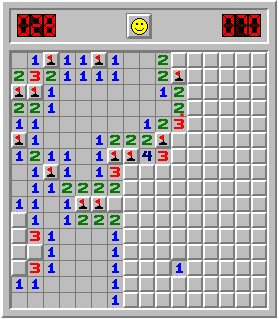

# Minesweeper implementation & custom AI player support

This faithful implementation of Minesweeper extends the original with support for AI players through an interface. It can be played either in the graphical mode (so that you may see the AI play, which can help with debugging) or a non-graphical mode which is optimised for performance.
It also supports sub-grid sampling, where the AI is provided a limited view of the board at any one time.

Built with Python.

## Why does this exist?
The motivation behind this version of Minesweeper was to allow for an environment that enables you to easily test your own AI agent(s) against Minesweeper and gather as much data from the runs as needed in an efficient non-graphical mode using an API.

It was used as part of an Undergraduate final-year project exploring the performance of a couple of AI players with different strategies. In particular, to see the effect limiting information given to the AI (board view size, use of flags) has on its ability to win.
The two built-in AI players are:
- An exact solver (always plays the best move with all available information)
- A naive solver (replicates the typical strategy a person would use)

For a more detailed discussion (and the results), see the full report in the repository.

